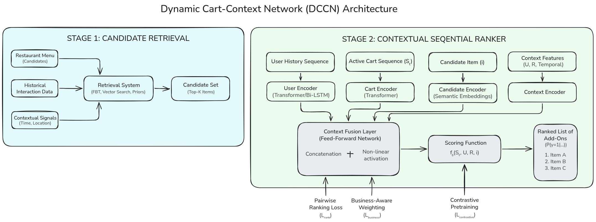
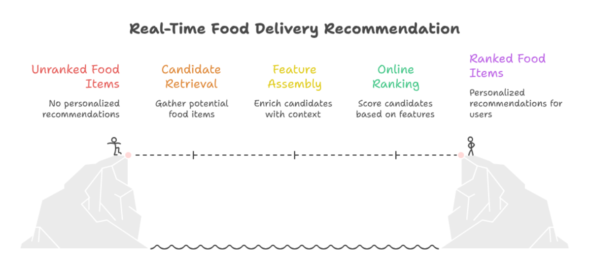
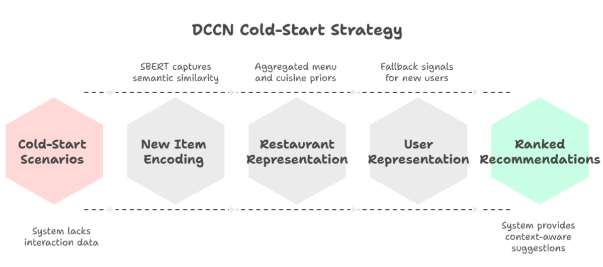
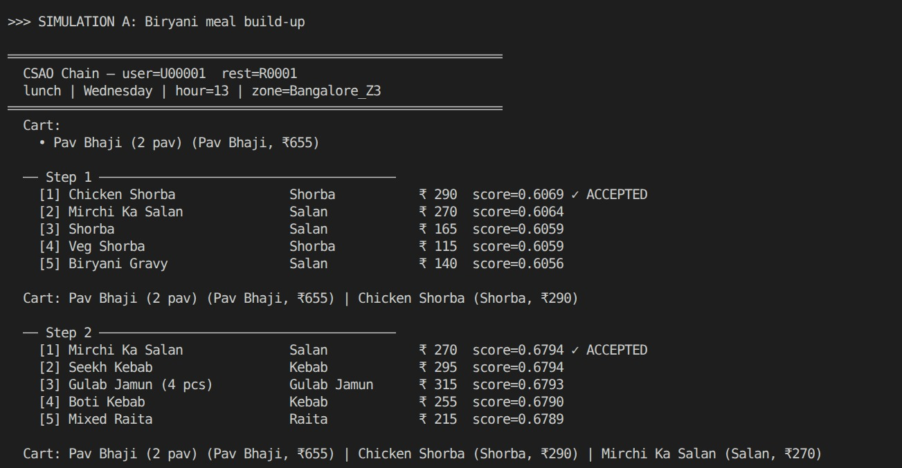
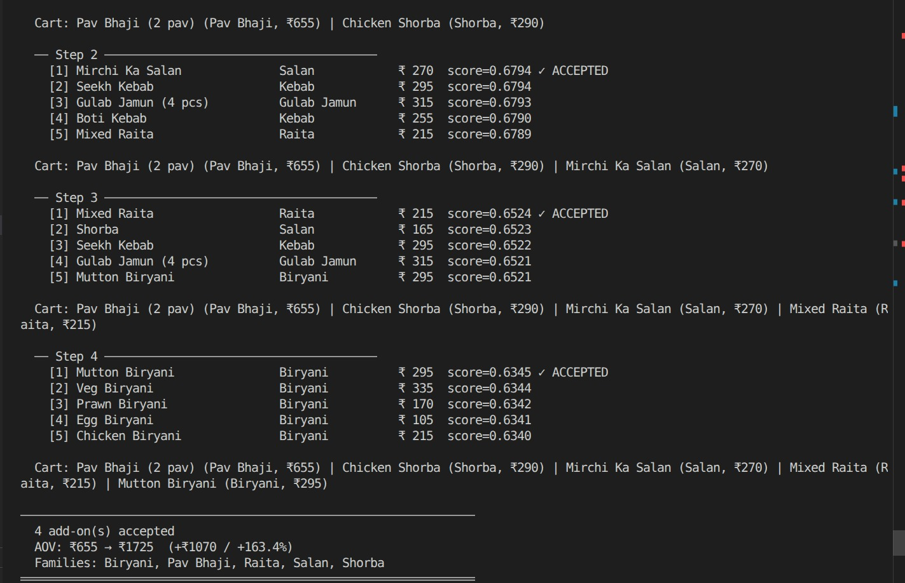
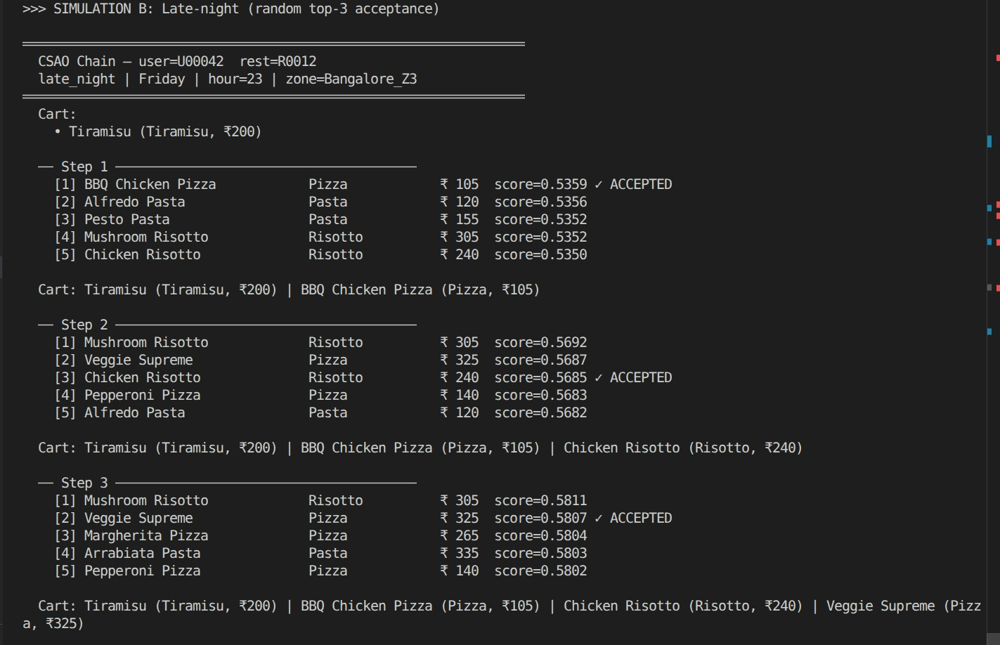
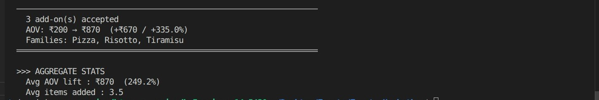

# Cart Super Add-On (CSAO) Rail Recommendation System

A two-stage retrieval and ranking framework for real-time cart add-on recommendations in food delivery platforms, built around the **Dynamic Cart-Context Network (DCCN)**.

## Problem Statement

The CSAO rail is a key lever for increasing Average Order Value (AOV) in food delivery. Unlike traditional recommendation systems, CSAO operates in a dynamic environment where each newly added item modifies user intent and affects subsequent recommendations. This makes the task **sequential**, **context-dependent**, and subject to **strict latency constraints** (≤ 300ms inference).

Conventional approaches (association rules, static collaborative filtering) treat the cart as a bag of co-occurring items and fail to capture sequential transitions within a single ordering session.

## Proposed Architecture — DCCN

The system formulates CSAO as a **contextual sequential ranking problem** and uses a two-stage pipeline:



### Stage 1: Candidate Retrieval
Reduces the full restaurant menu to ~50–100 candidates using:
- Frequently Bought Together (FBT) statistics
- Dense vector retrieval via Approximate Nearest Neighbor (ANN) search
- Meal-time popularity priors

### Stage 2: Contextual Sequential Ranker
- **Cart Encoder** — Lightweight Transformer over the ordered cart sequence to capture item interactions and meal progression dynamics.
- **User Encoder** — Bi-LSTM encoding long-term user history; embeddings are precomputed offline for low-latency serving.
- **Candidate Encoder** — Item representations initialized from pretrained Sentence-BERT embeddings for cold-start robustness.
- **Context Encoder** — Encodes temporal (cyclical hour/day), geographic (delivery zone), and restaurant features.
- **Context Fusion Layer** — Feed-forward network fusing all encoder outputs through concatenation + non-linear activation to produce the final score `f_θ(S_t, U, R, i)`.

### Scoring Objective
The model estimates `P(y=1 | S_t, U, R, i)` — the probability that candidate item `i` gets added to cart state `S_t`, given user features `U` and restaurant features `R`.

## Training Strategy

| Objective | Purpose |
|---|---|
| **BPR Pairwise Ranking Loss** (`L_rank`) | Optimizes relative ordering of positive vs. hard-negative items |
| **Business-Aware Weighting** (`L_business`) | Margin-aware weights to align ranking with AOV optimization |
| **InfoNCE Contrastive Pretraining** (`L_contrastive`) | Pretrain item embeddings using cart co-occurrence signals |

**Unified loss:** `L_total = L_rank + λ₁·L_business + λ₂·L_contrastive`

Training proceeds in two stages:
1. **Representation Transfer** — Item and sequential encoders pretrained with contrastive + next-item objectives.
2. **Task-Specific Fine-Tuning** — Full DCCN optimized with ranking + business-aware losses.

## Inference/Serving Architecture



## Cold-Start Handling

- **New Items** — Sentence-BERT embeddings capture semantic relationships before any interaction data exists.
- **New Restaurants** — Representations aggregated from pretrained item embeddings + cuisine-level priors.
- **New Users** — Model falls back to cart-context encoding and restaurant-level priors.



## Synthetic Data Pipeline

The `data_generator.py` script generates a realistic food delivery dataset with natural combo patterns.

**Scale:** 2,000 users · 150 restaurants · 50,000 orders · 10 cuisines

### Generated Files (`data/`)

| File | Description |
|---|---|
| `users.csv` | User profiles with segment, city, cuisine preferences, veg flag |
| `restaurants.csv` | Restaurant metadata — cuisine, price range, rating, zone |
| `menu_items.csv` | Menu items with dish family taxonomy, price, popularity score |
| `orders.csv` | Order-level metadata — meal time, cart value, day of week |
| `order_items.csv` | Item-level order rows with dish family and price |
| `user_item_interactions.csv` | **Core training data** — anchor/candidate item pairs with binary labels |
| `user_history_features.csv` | Aggregated per-user behavioral features (diversity factor, spend, top dish family) |
| `restaurant_performance_features.csv` | Aggregated restaurant performance stats |

### Data Realism
- **Spatio-temporal grounding** — Orders tagged with `meal_time`, `hour`, and `delivery_zone` to capture time-dependent and hyper-local demand patterns.
- **Natural combo logic** — 70% of carts are seeded with realistic food pairings (e.g., Biryani + Raita, Burger + Fries).
- **Behavioral sparsity** — Long-tail user distributions with explicit sparse-history features.
- **Dish family taxonomy** — Structured hierarchy prevents redundant recommendations and encourages complementary pairings.

### Usage
```bash
python data_generator.py
```
Outputs are written to the `data/` directory. Use `user_item_interactions.csv` as the core training dataset (binary classification: `label=1` for added items, `label=0` for negatives). Join with feature tables for the full feature set. Use temporal split on `order_datetime` for train/val/test.

## Evaluation

### Offline Metrics
- NDCG@K, Precision@K, Recall@K
- Walk-forward temporal validation with chronological splits

### Online A/B Testing
- **Control:** Popularity-weighted FBT matrix (Apriori-based)
- **Treatment:** DCCN Sequential Ranker
- **Primary metrics:** CSAO attach rate, AOV lift
- **Guardrails:** Cart Abandonment Rate, Cart-to-Order Conversion (with automatic circuit breakers)

## Simulation Results

### Lunch Order




### Late-night Order




## Tech Stack

- Python 3, NumPy, Pandas
- PyTorch (model implementation)
- Sentence-BERT (item embeddings)
- FAISS / ANN libraries (candidate retrieval)

## Project Structure

```
├── data_generator.py                  # Synthetic dataset generation script
├── data/
│   ├── users.csv
│   ├── restaurants.csv
│   ├── menu_items.csv
│   ├── orders.csv
│   ├── order_items.csv
│   ├── user_item_interactions.csv
│   ├── user_history_features.csv
│   └── restaurant_performance_features.csv
├── images/
├── recsys.py                          # Recommendation System
└── README.md
```

## Authors

- **Gourav Anirudh B J** — IIIT Bangalore
- **Sahil Kolte** — IIIT Bangalore
- **Sathish Adithiyaa S V** — IIIT Bangalore

## References

1. Rendle et al., "BPR: Bayesian Personalized Ranking from Implicit Feedback," UAI, 2009.
2. Hidasi et al., "Session-based Recommendations with Recurrent Neural Networks," ICLR, 2016.
3. Zhou et al., "Deep Interest Network for Click-Through Rate Prediction," ACM SIGKDD, 2018.
4. Reimers & Gurevych, "Sentence-BERT: Sentence Embeddings using Siamese BERT-Networks," EMNLP, 2019.
5. Vijjali et al., "FoodNet: Simplifying Online Food Ordering with Contextual Food Combos," Swiggy Bytes Tech Blog, 2021.